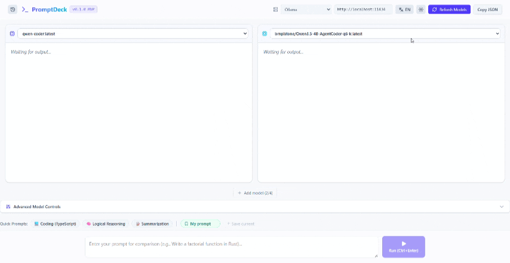
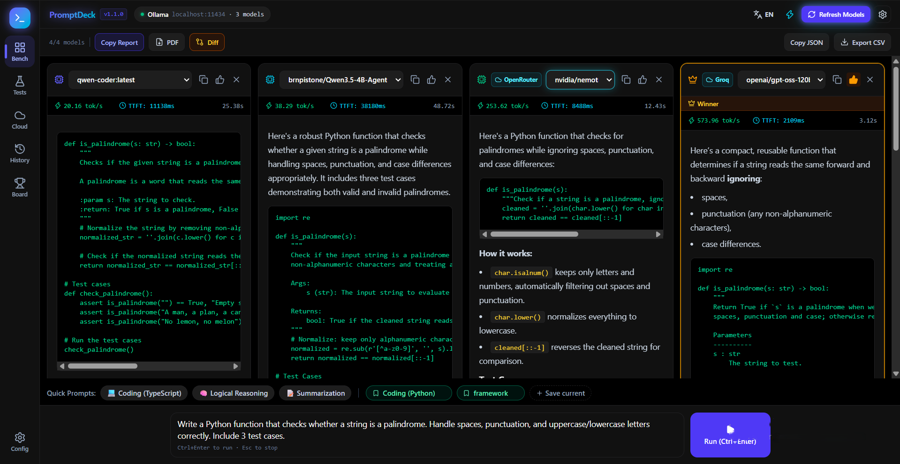
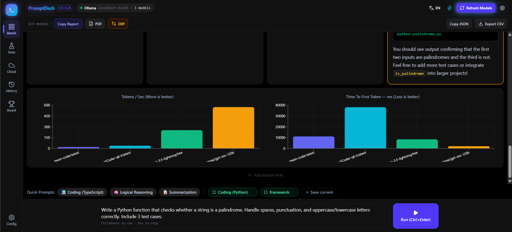
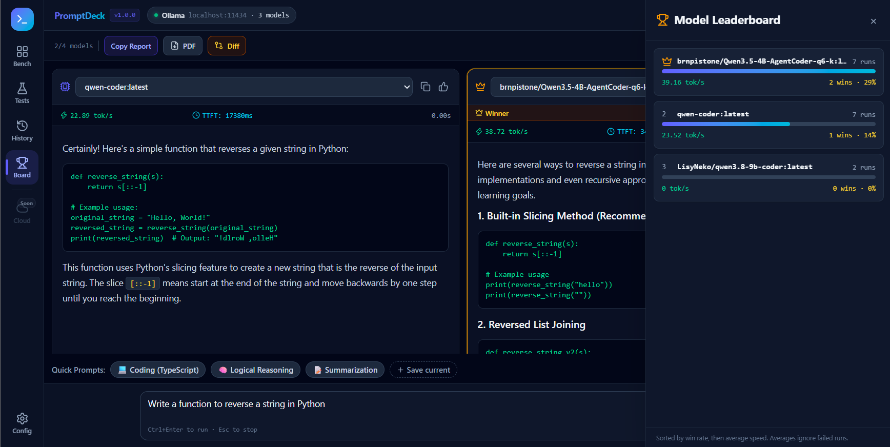
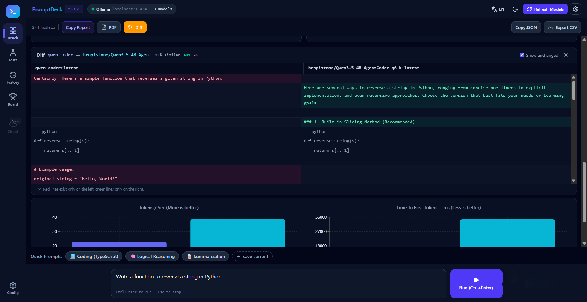
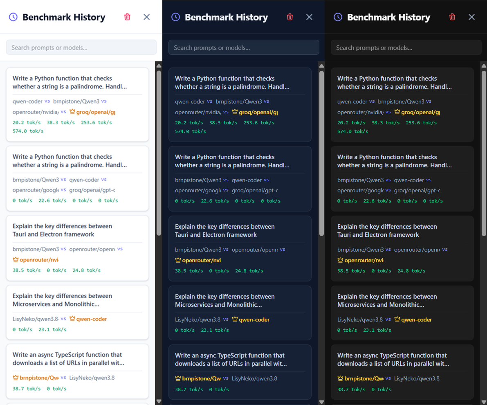
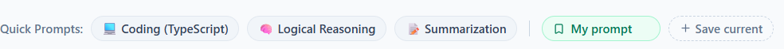

# 🚀 PromptDeck

**PromptDeck** is a local, open-source desktop studio for prompting and benchmarking LLMs side-by-side — fully offline, with no data ever leaving your machine.

Run the same prompt against multiple local models — via [Ollama](https://ollama.com), [LM Studio](https://lmstudio.ai), or a `llama.cpp` server — watch them stream in real time, and compare **Tokens/sec (TPS)**, **Time-To-First-Token (TTFT)**, and total duration, with results saved locally in SQLite for later review.


<!-- RETAKE for v0.3.0: main grid with 2+ models finished, winner crown badge on one column, Diff/CSV/Leaderboard buttons visible in header. Keep the same filename docs/screenshot-main.png and overwrite it -->

---

## ✨ Features

- ⚡ **Compare 2 to 4 models simultaneously** — run the same prompt across multiple models at once and watch them stream side-by-side
- 🔌 **Multi-provider support** — connect to [Ollama](https://ollama.com), [LM Studio](https://lmstudio.ai), or any `llama.cpp` server (OpenAI-compatible API)
- 📊 **Live metrics & visual charts** — TPS, TTFT, and total duration tracked per run, with bar charts comparing every model at a glance (`~` marks estimated TPS when the server doesn't report token usage)

  
  <!-- Optional retake: TPS/TTFT comparison bar charts (estimated bars render slightly faded) -->

- 🏆 **Winner votes & leaderboard** — crown the best answer per run and track win rate plus average speed per model over time

  
  <!-- NEW IMAGE: open the leaderboard panel (trophy button in header) with 2-3 models visible showing runs / avg TPS / wins. Save exactly as docs/screenshot-leaderboard.png -->

- 🔍 **Side-by-side diff view** — compare any two outputs line-by-line with similarity percentage and added/removed counts

  
  <!-- NEW IMAGE: run a comparison, click Diff, capture the diff panel below the grid with red/green lines visible. Save exactly as docs/screenshot-diff.png -->

- 🕘 **Local history** — every benchmark run is saved to SQLite and browsable from a sidebar, with winner crowns, `~` markers for estimated TPS, and full theme support

  
  <!-- History sidebar in light/dark mode -->

- 📝 **Markdown rendering** — model outputs render with full GFM support (tables, code blocks, etc.)
- 💾 **Savable prompt presets** — save your own frequently-used prompts alongside the built-in quick presets

  
  <!-- Built-in + user-saved presets row -->

- 📄 **Rich PDF export** — export any benchmark run as a fully-formatted PDF report, preserving Markdown rendering (tables, code blocks, bold text)
- ⌨️ **Keyboard shortcuts** — `Ctrl+Enter` (or `Cmd+Enter`) to run, `Esc` to stop generation or close panels
- ⚙️ **Advanced controls** — tweak system prompt, temperature, top-p, and context length (persisted across restarts)
- 🌗 **Dark / light theme** — applied consistently across the entire app, including history and charts
- 🌍 **i18n ready** — English and Persian (Farsi) included, with full RTL support
- 📋 **One-click export** — copy a Markdown report or full JSON history to clipboard, or download history as CSV
- 🔒 **100% local & private** — built with [Tauri](https://tauri.app), no telemetry, no cloud calls

---

## 🖥️ Tech Stack

| Layer | Technology |
|---|---|
| Shell | [Tauri 2](https://tauri.app) (Rust) |
| Frontend | React + TypeScript + Vite |
| Styling | Tailwind CSS v4 |
| State | Zustand (persisted) |
| Database | SQLite (via `tauri-plugin-sql`) |
| Charts | Recharts |
| PDF Export | jsPDF + html2canvas |
| i18n | react-i18next |
| Markdown | react-markdown + remark-gfm |

---

## 📦 Prerequisites

Before running PromptDeck, make sure you have at least one local LLM backend running:

- **[Ollama](https://ollama.com)** — running locally (`ollama serve`), with at least one model pulled:
  ```bash
  ollama pull llama3
  ```
- **or [LM Studio](https://lmstudio.ai)** — with a model loaded and the local server started (Developer tab → Start Server)
- **or a [`llama.cpp` server](https://github.com/ggerganov/llama.cpp)** — running with its OpenAI-compatible endpoint enabled

You'll also need:
1. **[Rust](https://www.rust-lang.org/tools/install)** (stable toolchain)
2. **[Node.js](https://nodejs.org)** (v18+) and npm

---

## 🚀 Getting Started

```bash
# 1. Clone the repo
git clone https://github.com/Cadman021/prompt-deck.git
cd prompt-deck

# 2. Install dependencies
npm install

# 3. Run in development mode
npm run tauri dev
```

To build a production binary for your OS:
```bash
npm run tauri build
```

---

## 📸 How it works

1. Launch the app and pick your provider (Ollama, LM Studio, or llama.cpp) from the header — PromptDeck auto-detects available models
2. Add up to 4 model columns, write a prompt (or pick/save a preset)
3. Hit **Run** (or `Ctrl+Enter`) — all selected models stream their responses live
4. Compare TPS / TTFT instantly via the chart, crown a winner, open the **Diff** view for any two outputs, or check the **Leaderboard** for long-term stats
5. Revisit past runs from the history sidebar, or export the whole report as PDF, Markdown, JSON, or CSV

---

## 🗺️ Roadmap

- [ ] Cost/pricing estimation for cloud-hosted OpenAI-compatible endpoints
- [x] Side-by-side diff view between two model outputs
- [x] Export benchmark history as CSV
- [ ] Custom color themes

Contributions and ideas are very welcome — see [Contributing](#-contributing) below.

---

## 🤝 Contributing

Issues and PRs are welcome! If you'd like to add a feature or fix a bug:

1. Fork the repo
2. Create a branch (`git checkout -b feature/my-feature`)
3. Commit your changes
4. Open a Pull Request

Please open an issue first for larger changes so we can discuss the approach. See [CONTRIBUTING.md](./CONTRIBUTING.md) for more details.

---

## 📄 License

This project is licensed under the [MIT License](./LICENSE).

---

## ⭐ Support

If you find PromptDeck useful, consider giving it a star — it helps others discover the project and motivates continued development!
