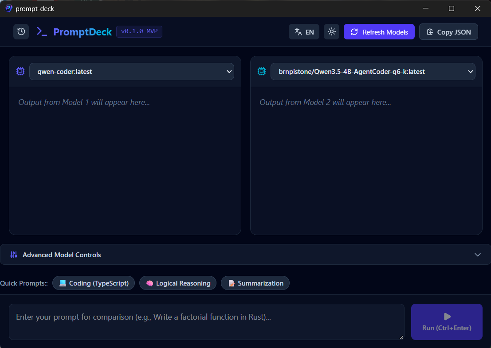

# 🚀 PromptDeck

**PromptDeck** is a local, open-source desktop studio for prompting and benchmarking [Ollama](https://ollama.com) models side-by-side — fully offline, with no data ever leaving your machine.

Run the same prompt against two local LLMs, watch them stream in real time, and compare **Tokens/sec (TPS)**, **Time-To-First-Token (TTFT)**, and total duration — all stored locally in SQLite for later review.



---

## ✨ Features

- ⚡ **Side-by-side benchmarking** — run two Ollama models on the same prompt simultaneously
- 📊 **Live metrics** — TPS, TTFT, and total duration tracked per run
- 🕘 **Local history** — every benchmark is saved to SQLite and browsable from a sidebar
- 📝 **Markdown rendering** — model outputs render with full GFM support (tables, code blocks, etc.)
- ⚙️ **Advanced controls** — tweak system prompt, temperature, top-p, and context length
- 🌗 **Dark / light theme**
- 🌍 **i18n ready** — English and Persian (Farsi) included, with RTL support
- 📋 **One-click export** — copy a Markdown report or full JSON history to clipboard
- 🔒 **100% local & private** — built with [Tauri](https://tauri.app), no telemetry, no cloud calls

---

## 🖥️ Tech Stack

| Layer | Technology |
|---|---|
| Shell | [Tauri 2](https://tauri.app) (Rust) |
| Frontend | React + TypeScript + Vite |
| Styling | Tailwind CSS v4 |
| State | Zustand |
| Database | SQLite (via `tauri-plugin-sql`) |
| i18n | react-i18next |
| Markdown | react-markdown + remark-gfm |

---

## 📦 Prerequisites

Before running PromptDeck, make sure you have:

1. **[Ollama](https://ollama.com)** installed and running locally (`ollama serve`), with at least one model pulled:
   ```bash
   ollama pull llama3
   ```
2. **[Rust](https://www.rust-lang.org/tools/install)** (stable toolchain)
3. **[Node.js](https://nodejs.org)** (v18+) and npm

---

## 🚀 Getting Started

```bash
# 1. Clone the repo
git clone https://github.com/Cadman021/prompt-deck.git
cd prompt-deck

# 2. Install dependencies
npm install

# 3. Run in development mode
npm run tauri dev
```

To build a production binary for your OS:
```bash
npm run tauri build
```

---

## 📸 How it works

1. Launch the app — it auto-detects models installed via Ollama
2. Pick a model for each column, write a prompt (or use a quick preset)
3. Hit **Run** — both models stream their responses live
4. Compare TPS / TTFT instantly, and revisit past runs from the history sidebar

---

## 🗺️ Roadmap

- [ ] Support for LM Studio / llama.cpp server as alternative backends
- [ ] Compare 3+ models at once
- [ ] Visual charts for TPS/TTFT trends over time
- [ ] User-defined, savable prompt presets
- [ ] Export benchmark report to PDF

Contributions and ideas are very welcome — see [Contributing](#-contributing) below.

---

## 🤝 Contributing

Issues and PRs are welcome! If you'd like to add a feature or fix a bug:

1. Fork the repo
2. Create a branch (`git checkout -b feature/my-feature`)
3. Commit your changes
4. Open a Pull Request

Please open an issue first for larger changes so we can discuss the approach.

---

## 📄 License

This project is licensed under the [MIT License](./LICENSE).

---

## ⭐ Support

If you find PromptDeck useful, consider giving it a star — it helps others discover the project and motivates continued development!
